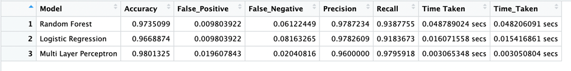
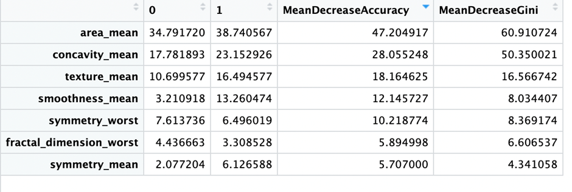
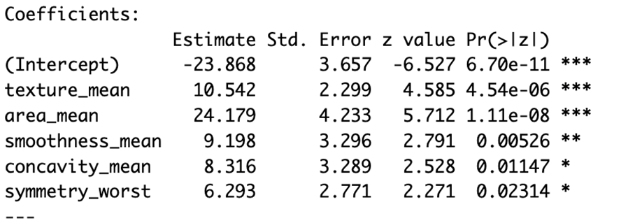

# Breast Cancer Diagnosis

Reviewing and replicating the paper on Diagnosis of Breast Cancer Using Random Forest
Link to paper: https://doi.org/10.1016/j.procs.2023.01.025
Link to Wisconsin Breast Cancer Dataset: https://archive.ics.uci.edu/dataset/17/breast+cancer+wisconsin+diagnostic

# Research Summary

The research article claims that Random Forest is the superior method for brest cancer diagnosis with both initial dataset after feature selection and minimal dataset where 8 features were selected out of the 16 features from the initial feature selection. 

Comparison was made using Accuracy, Precision, Recall, F1 Score and ROC-AUC curve
• Accuracy: The percentage of tumors whose malignancy was correctly predicted.
• Precision: TP / (TP + FP)
• Recall: TP / (TP + FN)
• F1 Score: (Precision * Recall) / (Precision + Recall)
• ROC-AUC Score: Area under the Receiver Operating Characteristic Curve.
Of which, having the least false positive is essential in diagnosis of patients, and thus Recall Value is an important metric.

# Project

In the study, only Random Forest is tuned with automated grid search, which was selected by training on the initial dataset with default parameters and comparing the recall value, while the other models are trained with their default parameters. 

As such, I would explore using Multilayer Perceptron/Neural Network with automated grid search with nodes between 1/3 to 2/3 of the number of variables, and either having 1 or 2 layers (Heaton, 2008). 

For Random Forest, I will calibrate the number of trees for stabilization of OOB error instead of doing an automated grid search, while leaving the mtry value (Random Subset Feature) to be the integer value of log2(M) + 1, where M is the number of x variables (Breiman, 2001).  

I will then compare the models with Recall value to make a fair comparison. I would also explore the feature importance with Random Forest permutation feature importance and Logistic Regression to understand if there is limited computation power, which feature is more important to include in the model training and testing. Lastly, I would measure the time taken for predicting test results, to estimate the model's computation power requirements after deployment.

# Results

From the results, MLP would be the best model, followed by Random Forest, then Linear Regression. 
MLP also takes the least time to run, followed by Linear Regression, then Random Forest.

Importance of variables:

From the Random Forest permutation feature importance and Linear Regression, we noted that the order of importance is as follows:
1. area mean
2. texture mean
3. concavity mean
4. smoothness mean
5. symmetry worst
6. fractal dimension worst
7. symmetry mean

# References

Breiman, L. (2001). Random Forests. Machine Learning, 45(1), 5–32. https://doi.org/10.1023/a:1010933404324 

Heaton, J. (2008). Introduction to neural networks for Java. 